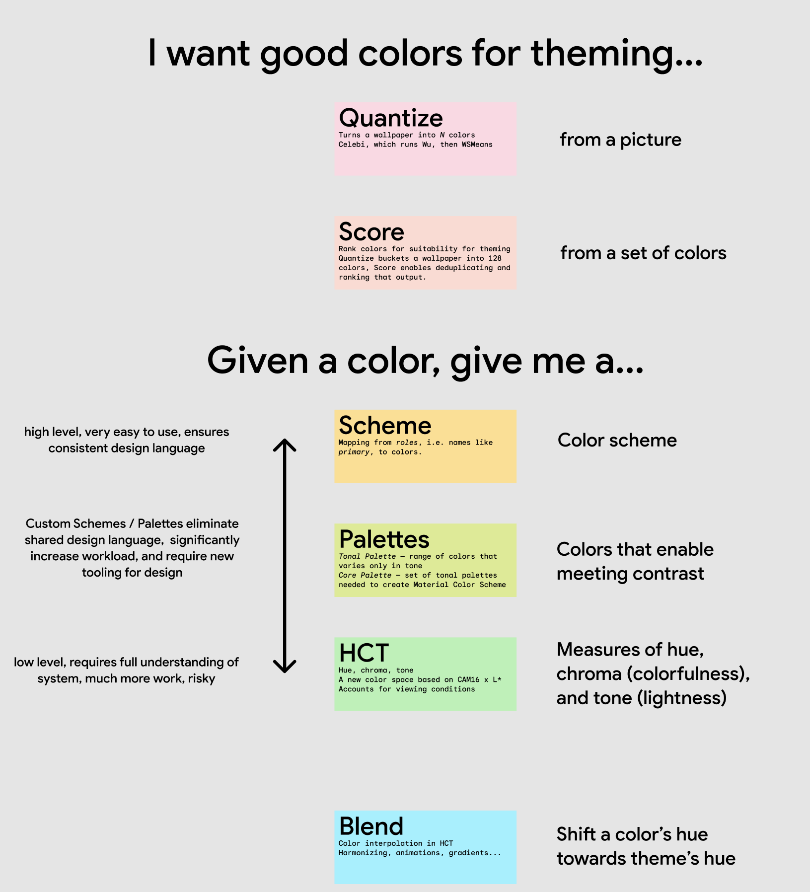

# Material color utilities

Algorithms and utilities that power the Material Design 3 (M3) color system,
including choosing theme colors from images and creating tones of colors; all in
a new color space.

<video autoplay muted loop src="https://user-images.githubusercontent.com/6655696/146014425-8e8e04bc-e646-4cc2-a3e7-97497a3e1b09.mp4" data-canonical-src="https://user-images.githubusercontent.com/6655696/146014425-8e8e04bc-e646-4cc2-a3e7-97497a3e1b09.mp4" class="d-block rounded-bottom-2 width-fit" style="max-height:640px;"></video>

## Library availability

Language    | Availability  | Package
----------- | ------------- | ------------------------------------------------------------------------------------------
C++         | ✅             |
Dart        | ✅             | 
Java        | ✅             | *Coming soon*
Objective-C | *Coming soon* |
TypeScript  | ✅             | 

Need another platform/language? Check the
[existing issues](https://github.com/material-foundation/material-color-utilities/labels/new%20library)
or open a new one.

## Usage

### Image to color

A common use case for this library is extracting a single color from an image.
Here's how to do that:

*Coming soon*

### Cheat sheet

### Components

The library is built out of multiple components

*   each with its own folder and tests
*   each as small as possible

This enables easy merging and updating of subsets into other libraries, such as
Material Design Components, Android System UI, etc.

*   Not all consumers will need every component — ex. MDC doesn’t need
    quantization/scoring/image extraction

#### Quantize

*   Turns a wallpaper into N colors
*   Celebi, which runs Wu, then WSMeans

#### Score

*   Rank colors for suitability for theming
*   Quantize buckets a wallpaper into 128 colors
*   Enables deduplicating and ranking that output.

#### Scheme

*   Mapping from roles, i.e. names like primary, to colors.

#### Palettes

*   Tonal Palette — range of colors that varies only in tone
*   Core Palette — set of tonal palettes needed to create Material color schemes

#### HCT

*   Hue, chroma, tone
*   A new color space based on CAM16 x L*
*   Accounts for viewing conditions

#### Blend

*   Color interpolation in HCT
*   Harmonizing, animations, gradients

#### Utils

*   Color — conversions between color spaces needed to implement HCT/CAM16
*   Math — functions for ex. ensuring hue is between 0 and 360, clamping, etc.

## Background

[The Science of Color & Design - Material Design](https://material.io/blog/science-of-color-design)

## Design Tooling

The
[Material Theme Builder](https://www.figma.com/community/plugin/1034969338659738588/Material-Theme-Builder)
Figma plugin and
[web tool](https://material-foundation.github.io/material-theme-builder/) are
recommended for design workflows. The Material Theme Builder delivers dynamic
color to where design is done. Designers can take an existing design, and see
what it looks like under different themes, with just a couple clicks.
