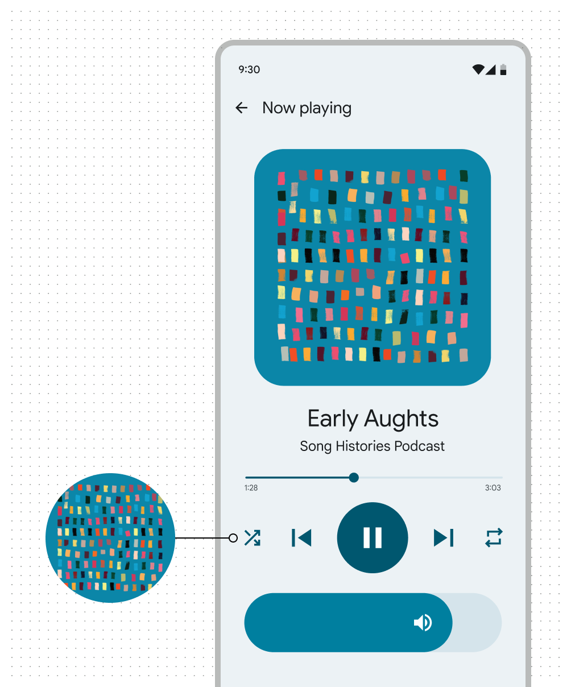

# Color Extraction

## Background

### From a wallpaper

User-generated color comes from a user's personal wallpaper. The wallpaper is
digitally analyzed through a process called quantization, and a single color is
selected as the source color.

### From in-app content

Content-based color comes from in-app content, like an album thumbnail image,
logo, or video preview. Like user-generated color, the image is digitally
analyzed through quantization, and a single color selected as the source color.

## Extracting colors from an image

### Quantize

This is a lossy compression process to select a limited number of distinct
colors that best reproduces the original image's appearance. The recommended
quantizer is Celebi, which uses results from Wu and WSMeans.

### Scoring

Evaluate and rank colors based on their suitability for UI themes. It
prioritizes colors that are both visually appealing and frequently used within a
given image. The main usage of scoring is to extract a set of dominant and
vibrant colors to use as source color to generate a dynamic color scheme.

Key metrics include:

-   **Color diversity:** The algorithm promotes visually distinct colors by
    giving higher scores to hues that are well-represented in the image within a
    30-degree neighborhood on the color wheel. It also iteratively tests
    different minimum hue differences to find a set that meets the desired
    number of colors while maintaining good hue distribution.

-   **Vibrant chroma:** Colors closer to the target chroma of 48.0 receive
    higher scores. Colors with very low chroma (close to grayscale) or those
    that are extremely rare in the image will be filtered out.

## To color themes

Ever wonder how Pixel extracts colors from a phone wallpaper to create
accessible and beautiful UIs? The steps can be summarized as follows:

1.  Quantize to obtain a representative set of colors from the wallpaper.
1.  Score to obtain suitable source colors.
1.  Present theme options by pairing the resulting source colors with available
    scheme variants to the user and let them pick.
1.  Create tonal palettes from the user-selected theme.
1.  Assign Material color roles with values from these tonal palettes.
1.  Colors get applied to UIs via Material tokens.
