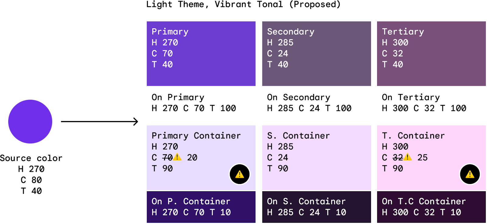

# MCU Scheme Generation

## Requirements for Dynamic Scheme

As described in [Dynamic Color Scheme](dynamic_color_scheme.md), `DynamicScheme`
generation aims to generate colors that satisfy constraints on visual
accessibility and visual expression and trueness of colors.

### Hard constraints

1.  The contrast ratio between the foreground and background should fall within
    a specified range.
1.  Certain color roles ought to fall within a specified range of tones.
1.  Tone delta between x and xContainer pairs, such as primary and
    primaryContainer, should be higher than a minimum.
1.  secondaryContainer prioritizes matching chroma over tone. This implies that
    it may adjust tone, in a specific direction, to achieve chroma as close as
    possible to the desired chroma.
1.  tertiaryContainer should not be disliked, otherwise it would be lightened.

### Soft constraints

1.  Tone should be as close to a "reference standard" as possible.
1.  The distribution of tones should be even across colors.
1.  The contrast level should ideally be at a certain level, but it is not
    required.

## How MCU derives Dynamic Scheme

Above constraints are expressed as algebraic formulas and solved in the
following steps:

### 1. Starting tone specs

MCU assigns all colors a "starting" tone value according to design spec. All
colors are assigned one starting tone for the light theme and one for dark
theme. For example, primary uses Tone 40 (more white) in Light theme and Tone 80
in Dark theme

In non-fidelity schemes, the tone level for each dynamic color remains fixed. In
fidelity schemes, MCU can adjust the tones to achieve a preferred chroma as
explained in Step 3.

### 2. Hue & chroma spec

MCU assigns all colors their hue and chroma values according to the scheme
variant spec.

For instance, the scheme variant here sets the primary palette to use the same
hue with the source color (H270), while the tertiary palette shifts the hue by
30 (H300).

### 3. Fidelity tone adjustments

After the above steps (1) and (2), each color in the scheme has the necessary
HCT values to create a color. However, the resulting color may need revision
because it is visually suboptimal or "impossible", i.e. the color of the given
Hue cannot reach the assigned Chroma at the assigned Tone.

To revise such colors, MCU can adjust their tones using one of two possible
"fidelity" behaviors.

-   Source: Adjust the color's tone to match that of the source color.
-   Reach Chroma: Adjust the color's tone until the color's chroma reaches that
    specified by the Variant.

### 4. Global tone constraints

While adjusting colors' tones, MCU follows global constraints to ensure visual
hierarchy and quality. Where fidelity tone adjustments and global tone
constraints conflict, global tone constraints take priority.

### 5. Contrast tone adjustments & requirements

Finally, MCU adjusts tones to meet contrast requirements by assessing the
contrast ratios between colors and their assigned backgrounds. In
color/background pairings where the target contrast ratio is not met, MCU
adjusts the tone of the foreground color to reach the target ratio, according to
the contrast level that is set.

Note that contrast ratios may not always reach the targets. For example, if a
background color is a mid-tone T50, its highest contrast on-color (white) only
reaches a contrast ratio of ~4.5:1. However, the targets will ensure that
GAR/WCAAG minimum requirements are met.
